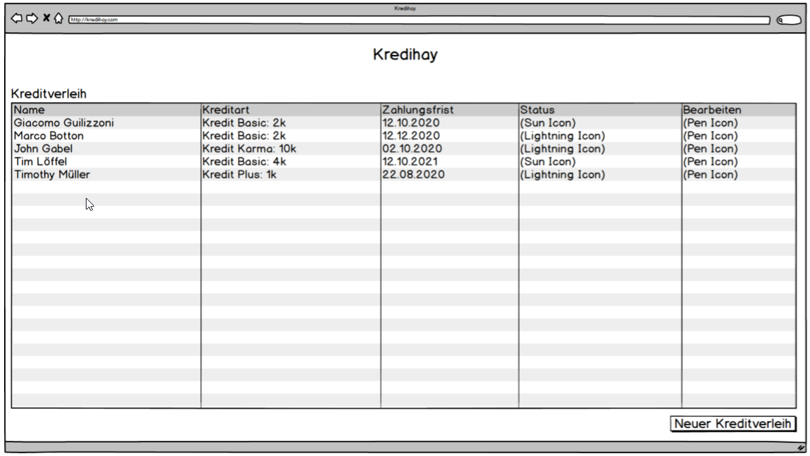
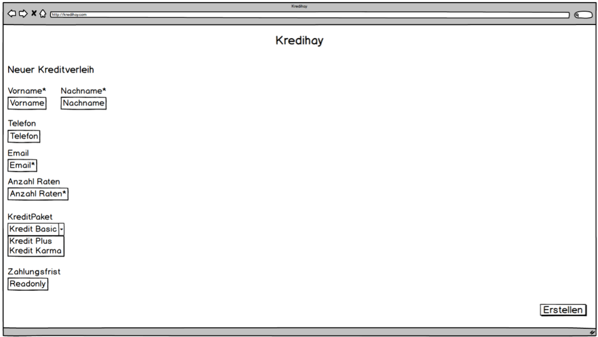
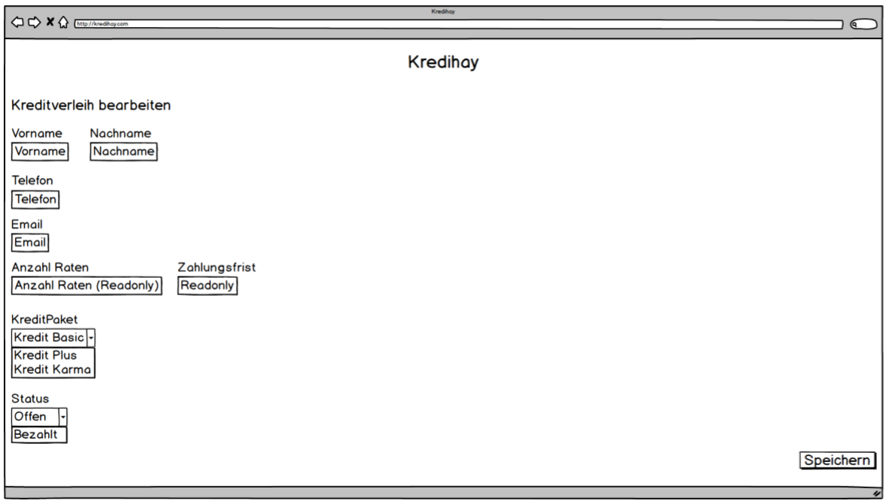

# M307-Kredihay

## Formulare

"Welcome" view

"New credit loan" view

"Edit credit loan" view

## Validierung
Welcome view
  - Keine validierung
  
New credit loan view
  - Vorname -> Required
  - Nachname -> Required
  - Telefon -> Besteht nur aus Nummern, Leerzeichen und den Symbolen +/-
  - Email -> Enthält @-Zeichen
  - Anzahl Raten -> Required
  - Kredit Paket -> Required
  
Edit credit loan view
  - Vorname -> Not empty
  - Nachname -> Not empty
  - Telefon -> Besteht nur aus Nummern, Leerzeichen und den Symbolen +/-
  - Email -> Enthält @-Zeichen
  - Anzahl Raten -> Not empty
  - Kredit Paket -> Not empty
  - Status -> Not empty

## Datenbank

Table Creditdeals
  - packageId int primary key auto_increment
  - packagename varchar(50) not null
  
Table Status
  - statusId int primary key not null
  - description varchar(50) not null
  
Table CreditLoan
  - creditId int primary key auto_increment
  - firstname varchar(50) not null
  - lastname varchar(50) not null
  - email varchar(80) not null
  - phone varchar(20)
  - ratesCount int not null
  - deadline date
  - fk_creditdealsId int
  - fk_statusId int

## Testfälle

Testfall 1:
- GEGEBEN ->   Keine Kredite
- WENN    ->   Ich erstelle einen neuen korrekten Kredit
- DANN    ->   Der neue Kredit erscheint in der Liste

Testfall 2:
- GEGEBEN ->   Keine Kredite
- WENN    ->   Ich versuche einen falschen Kredit zu erstellen
- DANN    ->   Es erscheint eine Fehlermeldung und die erstellen View bleibt offen

Testfall 3:
- GEGEBEN ->   Keine Kredite
- WENN    ->   Ich versuche einen Kredit zu erstellen
- DANN    ->   Das Enddatum des Kredites wird direkt nach der Eingabe der Anzahl Raten berechnet und angezeigt

Testfall 4:
- GEGEBEN ->   Keine Kredite
- WENN    ->   Ich erstelle einen Kredit, aber fülle nicht alle pflichtfelder aus
- DANN    ->   Die Validierung wird eine Fehlermeldung dem Benutzer ausgeben und die Daten im Server nicht speichern

Testfall 5:
- GEGEBEN ->   Keine Kredite
- WENN    ->   Ich fülle einen Kredit mit mehr als 10 Raten aus
- DANN    ->   Fehlermeldung wird ausgegeben, dass höchstens 10 Raten existieren dürfen

Testfall 6:
- GEGEBEN ->   Keine Kredite
- WENN    ->   Ich erstelle einen Kredit
- DANN    ->   Der Status wird direkt auf offen gesetzt

Testfall 7:
- GEGEBEN ->   Zwei Kredite
- WENN    ->   Ich setze einen Kredit auf geschlossen
- DANN    ->   Nur noch der offene Kredit wird angezeigt

Testfall 8:
- GEGEBEN ->   Ein Kredit
- WENN    ->   Ich ändere den Namen des Kreditenehmers
- DANN    ->   Der neue Namen wird in der Datenbank aktuallisert und in der Liste angezeigt

Testfall 9:
- GEGEBEN ->   Vier Kredite
- WENN    ->   Ich sortiere nach Deadline
- DANN    ->   Die richtige Reihenfolge wird angezeigt

Testfall 10:
- GEGEBEN ->   Ein Kredit
- WENN    ->   Ich editieren den Kredit
- DANN    ->   Es werden alle Felder angezeigt, ich kann nur bestimmte Felder editieren

## Roadmap
Trello: https://trello.com/b/qmQloeKg/m307-kredihay
